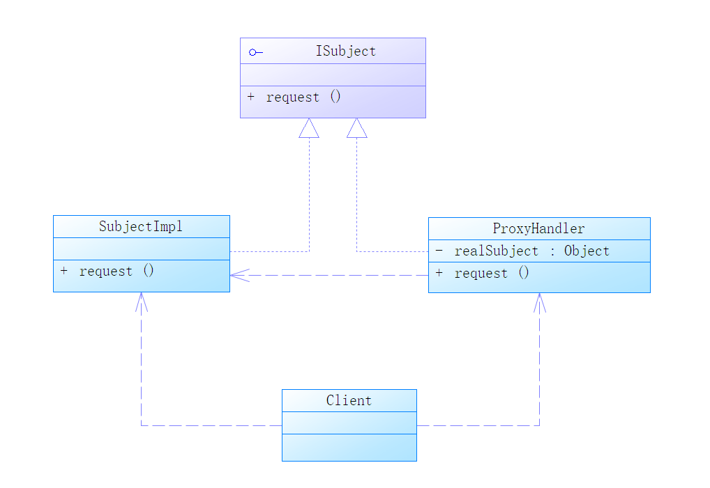
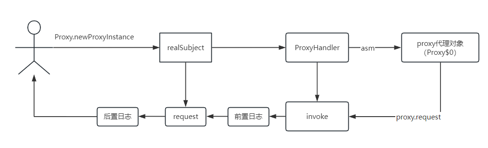
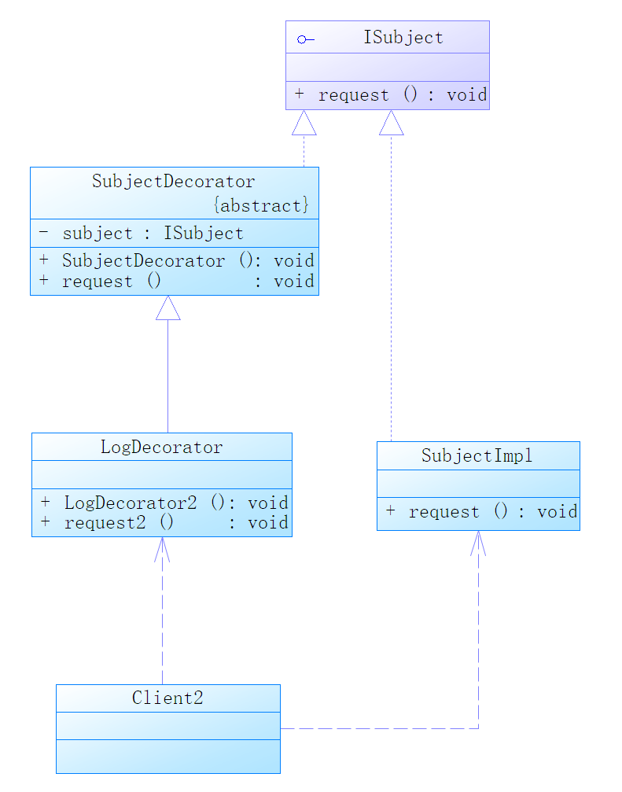

# 代理模式
1、控制目标对象的访问，如权限控制，安全检查
2、增强目标对象功能
## 代理模式的种类
* 静态代理
* 动态代理
  * JDK
  * CGLIB
## 代理模式应用
- Spring AOP的实现就是基于代理模式的。它会根据情况选择选择JDK或CGLIB
- 可以实现与主要业务逻辑进行分离。
- 可以在不修改原始业务逻辑代码的情况下，动态地将横切关注点织入到目标方法的前后或周围，从而实现对系统的功能增强和业务逻辑的解耦。
## 静态代理类图

## JDK动态代理

## 代理模式与装饰者模式
- 代理模式注重于控制对对象的访问
- 装饰者模式允许在不变原始对象的结构的情况下，动态地为对象增加新的功能
## 装饰者类图
